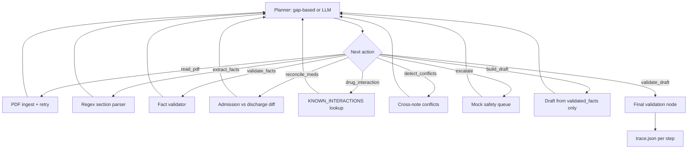

# Agentic AI for Discharge Summaries

Production-style **draft** discharge summary agent for clinician review. Reads synthetic source-note PDFs, plans and re-plans over tool results, and never fabricates missing clinical facts.

> **The system is designed to prefer omission over hallucination.**

> **Demo video:** Record your own 3–5 minute Loom walkthrough (not generated by this repo). Suggested patients: **P004** (allergy conflict) and **P002** or **P003** (pending / med reconciliation flags).

## Quick start

```powershell
cd "c:\Users\Manobhiram\Documents\patient-discharge-agent(dscribe)"
python -m venv .venv
.\.venv\Scripts\Activate.ps1
pip install -r requirements.txt
copy .env.example .env

# Generate synthetic PDF dataset (5 patients)
python scripts/generate_synthetic_data.py

# Single patient
python -m agent run --patient P001

# All patients → outputs/<patient_id>/
python -m agent run-all

# Part 2: simulated reviewer + metrics
python -m learning.evaluate
```

Optional: set `OPENAI_API_KEY` in `.env` for LLM-assisted **planning** (extraction and draft fields remain rule-based from PDF text only).

The ingestion layer is designed to handle heterogeneous clinical document formats, including native-text PDFs, scanned documents requiring OCR, embedded images, and semi-structured tables. Extraction strategies are selected adaptively based on document characteristics and extraction confidence. Low-confidence OCR results are surfaced explicitly through `document_quality` rather than silently trusted, allowing clinician review for noisy clinical scans.

## Architecture



### Agent loop (not a fixed pipeline)

Each iteration: **reasoning → tool → inputs → result → next decision** (see `outputs/<id>/trace.json`). The rule planner **re-orders work** from observations—for example, allergy conflicts before med reconciliation, interactions after flagged med changes, and a final `validate_draft` node before output. State lives in typed `AgentState` (`patient_id`, `extracted_facts`, `validated_facts`, `missing_fields`, `conflicts`, `pending_results`, `escalation_flags`, `iteration_count`). With `OPENAI_API_KEY`, the same action set can be chosen by an LLM planner; clinical content still comes only from parsed PDF spans.

### No-fabrication guardrails

- The system is designed to prefer omission over hallucination.
- Fields use `documented | missing | pending | conflict` via `SourcedValue` with **source file + page** on every documented fact
- Empty sections stay explicitly **MISSING — not documented in source notes** — no plausible invented values
- Banner on every draft: **DRAFT FOR CLINICIAN REVIEW**
- Hospital course / diagnoses only from labeled sections in source text

### Failures, conflicts, medications

| Mechanism | Implementation |
|-----------|----------------|
| PDF failures | `MAX_RETRIES=2`, `PDF_EXTRACTION_FAILED` flag; empty text treated as unreadable |
| Conflicts | `agent/conflicts.py` — allergy/date contradictions; never auto-resolved |
| Med reconciliation | `agent/med_reconciliation.py` — flags new/discontinued/dose changes without `reason:` in source |
| Mock tools | `drug_interaction_lookup`, `safety_escalation` — agent invokes when planner reaches those gates |
| Step cap | `AGENT_MAX_STEPS` (default 25) — partial draft + flag, no silent success |

## Outputs

Per patient (`outputs/<patient_id>/`):

- `draft.json` — structured draft
- `draft.md` — human-readable draft
- `trace.json` — full observability trace

Batch: `outputs/batch_summary.json`

## Synthetic patients

| ID | Scenario |
|----|----------|
| P001 | Complete, straightforward |
| P002 | Pending urine culture / BMP |
| P003 | Metoprolol dose ↑ + new aspirin **without** documented reason |
| P004 | NKDA (nursing) vs sulfa allergy (physician) |
| P005 | Warfarin + aspirin — interaction escalation |

## Part 2 (stretch)

- **Reward:** section match rate between draft and simulated edit (`learning/reviewer.py`)
- **Simulated reviewer:** consistent hidden policy (principal dx from secondary, follow-up wording, pharmacist flag on med issues)
- **Learning:** correction memory (`learning/memory.py`) — interpretable hints vs bandit/DPO (needs more data, harder to audit)
- **Metrics:** `outputs/learning/metrics.json`, `(draft, edited)` pairs under `outputs/learning/pairs/`
- **Limitations:** cold start, edit-distance gaming risk, safety preserved by not optimizing away flags

## Limitations

**OCR Limitations**
- Handwriting recognition not supported; only printed text extraction
- Low-quality scans may result in incomplete extraction
- OCR confidence threshold (0.50) may miss some valid text to avoid hallucinations
- Page limit (30 pages) balances memory usage vs coverage

**Semantic Conflict Detection**
- Limited to pattern-based conflict detection (allergy contradictions, date mismatches)
- Does not perform semantic understanding of clinical context
- Cannot detect nuanced clinical inconsistencies without explicit patterns

**Extraction Recall**
- Pattern-based extraction may miss non-standard document formats
- Requires structured headers or specific patterns for reliable extraction
- Unstructured clinical notes may have lower extraction rates

**Clinical Safety**
- **Clinician review always required** - this is a draft generation system, not autonomous clinical decision-making
- System prefers omission over hallucination - missing fields are explicitly marked
- Does not replace human clinical judgment or verification

**System Design**
- Deterministic rule-based extraction - no LLM hallucination risk
- Graceful degradation on low-quality documents
- Full traceability via `trace.json` for audit trails

## If I had more time

- FHIR / HL7 note ingestion; OCR for scanned PDFs
- Human-in-the-loop UI with accept/reject per section
- Stronger LLM extraction with cite-span grounding only
- Real interaction API behind consent boundary; audit log export
- ## If I Had More Time

* FHIR / HL7 ingestion and interoperability support for structured EHR integration
* More advanced OCR and handwriting-aware parsing for scanned clinical documents
* Human-in-the-loop review UI with section-level accept/reject and provenance inspection
* Stronger semantic extraction with citation-grounded evidence spans only
* Enhanced semantic conflict detection across heterogeneous clinical notes
* Lightweight clinician-feedback learning loop using correction-memory and edit-distance-based reward signals
* Real clinical safety tooling integration (drug interaction APIs, audit logging, escalation workflows)
* Improved diagnosis aggregation and longitudinal patient timeline reconstruction

Part 2 (learning from clinician edits) was not fully implemented within the assignment time window. Given more time, I would extend the system with a measurable reviewer-feedback loop using simulated reviewer corrections, section-level edit metrics, and correction-aware extraction refinement while preserving the system’s no-fabrication guarantees.


## License/data

Synthetic data only. Do not commit `.env` or real PHI.
